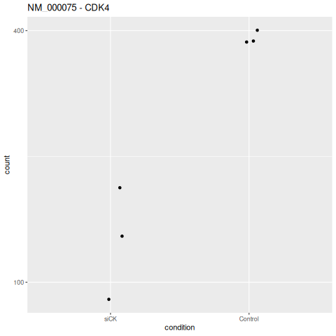

### Contents
[Main page](README.md) 

- [Graphical outputs](#graphical-outputs)
    - [Gene expression plots](#gene-expression-plots)
    - [Heatmaps](#heat-maps)
        - [Transcript expression data](#heatmaps-of-expression-level-changes-of-transcripts)
        - [Pairwise sample analysis](#heatmaps-comparing-the-samples-to-each-other)
    - [PCA plots](#pca-plots)
    - [ReactomePA graphs](#reactomepa-graphs)
    - [KEGG pathway maps](#kegg-pathway-maps)
    - [Volcano plots](#volcano-plots)
 
 ---

# Graphical outputs

While the most important output from a differential gene expression analysis is the table of differentially expressed genes, a typical pipeline will also create a range of images. These may be used to summarise the analysis in reports or to check for any systematic bias or errors in the analysis.

## Gene expression plots

A basic output from an analysis pipeline are graphs that show the expression levels of each transcript in an experiment. These graphs can be used to visualise  the change in expression of a transcript of interest.

Figure 1: A graph of CDK4 expression showing its level in the siCK samples is lower than in the linked controls. The graph also shows CDK4 expression is more variable in the diCK samples than the controls.

## Heat maps

Heatmaps provide a simple way to visualise the differences between samples. The display can consist of the comparison of a single value in each sample ([see here](#heatmaps-comparing-the-samples-to-each-other)) or an array of values for each sample ([see here](#heatmaps-of-expression-level-changes-of-transcripts)).

- ## Heatmaps of expression level changes of transcripts

Heatmaps are often used to display the clustering of differentially expressed transcripts or genes in the samples. The gene's/transcript's colour is determined by its level of expression. The clustering is performed by comparing each transcript's expression profile to the other profiles, placing transcripts with similar profiles closer to each other. The clustering of the samples is performed by comparing each sample's transcript expression levels to the other samples and placing the most similar samples together. 

In each case the clustering may be shown as a dendrogram at the side of the heatmap.

In Figure 2a, the colouring of the transcripts is determined by the transcripts' expression level in a sample relative to their expression level in the other samples. However, in Figure 2b, the colour of a transcript is based on its expression level in a sample relative to the expression levels of all transcripts in that sample.

__Note__: The data in Figures 2a and 2b is the same, but the way the expression levels are compared for each heatmap is different.

Figure 2: Heatmaps showing the expression profiles in the modified samples (siCK 1 to 3) and the control samples (siNT 1 to 3). The dendrograms on the left show how the transcripts cluster, while the dendrogram across the top shows how the samples cluster.

- ## Heatmaps comparing the samples to each other

Heatmaps can be used to compare the samples in the analysis to determine which samples are more alike. In Figure 3, the expression values of the transcripts in each sample are used to make a distance score between each pair of samples. These values are then used to create the heatmap, where the darker the blue, the more alike the pair of samples are. The diagonal line of squares represents the results of comparing each sample to itself. 

Figure 3: Heatmap showing how alike the sample's expression profiles are to each other. The order of the rows is the same as the order of the columns. Each label is comprised of the sample's _condition_ (control or siCk) and the sample's name.

## PCA plots

A PCA plot shows how samples relate to one another by reducing transcript expression measurements into just a few values called principal components. These capture the major sources of variation in the dataset. Each point on a PCA plot represents a sample, and the distance between points reflects how similar or different their overall expression profiles are. The x-axis is the value of the first principal component (PCA1), while the y-axis shows the value of the second principal component (PCA2). 

Figure 4: In this PCA plot the samples are individually colour codes with their  sample type (control or siCK) and sample name shown in the __Group__ legend.

## ReactomePA graphs

Reactome is a manually curated, peer‑reviewed database of biological pathways that are known to occur in cells. There are lists of genes linked by a biological activity, such as __rRNA processing__, __Organelle biogenesis and maintenance__ and __Chromatin modifying enzymes__. Each pathway will contain multiple genes and a gene may be linked to more than one pathway.

ReactomePA identifies pathway contain an excess of DEGs compared to the expected number. The results of the analysis can then be exported as graphs showing the pathways whose linked gene's expression varies the most between the different types of sample.

Figure 5: A ReactomePA graphic in which the top 25 pathways are shown. Table 1 describes the graph's scaling.

__Table 1__

|Feature|Description|
|-|-|
|Colour of data point|The colour of each data point indicates its statistical significance|
|Size of data point|Number of DEGs linked to pathway|
|Data point's x-axis value|The ratio of DEGs in pathway to number of all genes in the pathway|

---

## KEGG pathway maps

KEGG pathways are another set of manually curated, peer‑reviewed biological pathways that are known in various organisms. Like the Reactome pathways, each pathway describes a specific function such as __Central carbon metabolism in cancer__, __Cytokine-cytokine receptor interaction__ and 
__Virion - Hepatitis viruses__. Each pathway will contain multiple genes and a gene may be linked to more than one pathway.

The KEGG organisation has created a graphic for each pathway showing how different items in the pathway interact. It is possible to colour code genes in the pathway's map based on a gene's change in expression, allowing the visualisation of a pathway's activation or deactivation based on the differences between the two types of samples.

Figure 6: The KEGG pathway map of the __Cellular senescence__ pathway with genes with increased expression shown in red and those with reduced expression shown in green.

## Volcano plots

Volcano plots are used to visualise the results of differential gene expression analysis. The fold change in transcript expression between the two sample conditions is shown on the x-axis and its statistical significance is shown on the y-axis. Both values are visualised as the log of the value, so the graph's scale is more informative - highlighting datapoints with comparatively small values. Similarly, the __minus__ value of the log(p-value) is shown so that significant transcripts are at the top of the graph.

Transcripts with large positive and negative changes in their expression occur on the right and left edges of the graph, while those with a high level of statistically significant appear at the top of the graph.

When used with a large number of data points, they enable the viewer to understand the general trends of an analysis. If used with fewer data points, they may allow individual transcripts to be visualised.

Figure 7: See Table 2 for description

__Table 2__

|Colour|Description|
|-|-|
|Grey|Transcripts with small changes in expression that are not statistical significant|
|Green|Transcripts with larger changes in expression that are not statistical significant|
|Blue|Transcripts with small but statistical significant changes in expression.|
|Red|Transcripts with large , changes in expression.|

---

