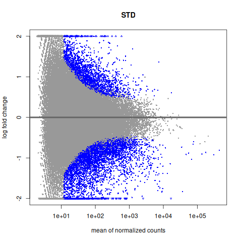
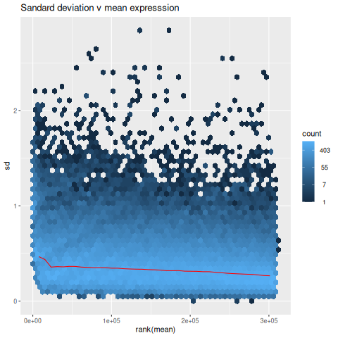
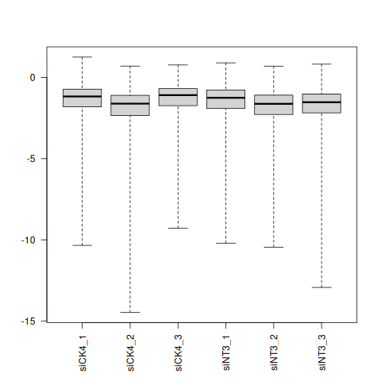
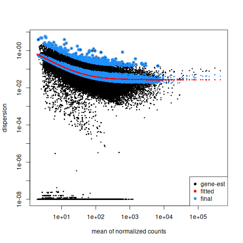
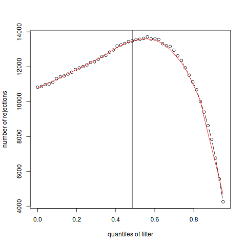
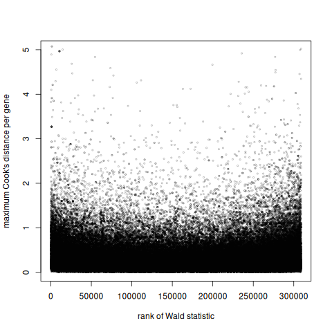
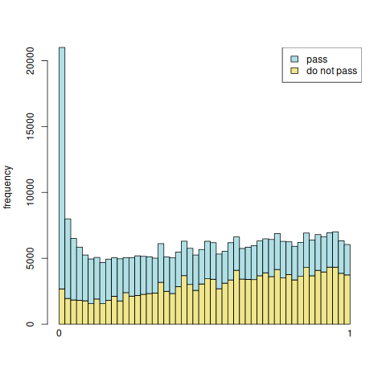
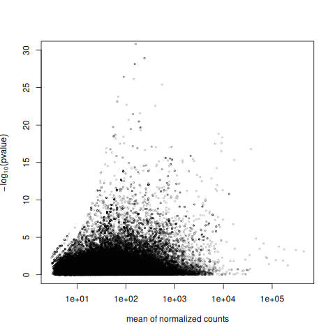

### Contents
[Main page](README.md) 

- [Analysis validation](#analysis-validation)
    - [Mean expression versus log2[fold change]](#mean-expression-versus-log2fold-change)
    - [Expression mean versus transcript variance](#expression-mean-versus-transcript-variance)
    - [PCook's distance](#cooks-distance---samples-with-unusual-transcript-levels)
    - [Dispersion plots](#dispersion-plots)
    - [Independent filtering of results](#independent-filtering-of-results)
    - [Rank of Wald statistic](#rank-of-wald-statistic)
    - [Histogram of p-values that passed or failed filter at each cutoff value](#histogram-of-p-values-that-passed-or-failed-filter-at-each-cutoff-value)
    - [–log10(p‑value) vs mean normalised counts](#log10pvalue-vs-mean-normalised-counts)

# Analysis validation

As well as producing data intended to instigate further work a good analysis pipeline will also generate images that allow you to check the integrity of the analysis. The following sections show some images a standard DESeq2 analysis may produce and briefly explain what they mean. For more information read the DESeq22 [vignette](https://www.bioconductor.org/packages/release/bioc/vignettes/DESeq2/inst/doc/DESeq2.html).

## Mean expression versus log2[fold change]

Figure 1 graph shows the how a transcripts expression changes with respect its expression level. The blue points represent differentially expressed transcripts. Typically, transcripts with low expression levels achieve larger fold changes as its easier to go from 10 counts to 100 than it is to go from 1 million to 10 million. Large changes in lowly expressed transcripts are more likely to be affected by random events and so are less likely to be statistically significant.

Figure 1: Expression levels versus Log2[fold change]. The STD title indicates the data has been normalised by the default (standard) DESeq2 function.

## Expression mean versus transcript variance

After normalisation of the data the link between expression levels and sample variation is reduced. These graphs show the effect of this normalisation, with the outlying data points representing differentially expressed transcripts. If the graph shows a red line significantly different from the one in Figure 2 or there is a very large number of outliers, it suggest there are issues with the imported read count data.

Figure 2: Graph of Expression mean versus transcript variance.

## Cook's distance - samples with unusual transcript levels

When viewing a very large number of transcripts in a sample, some transcripts will have an unusual expression level when compared to the other samples. This is not an issue unless a large number of transcripts display unexpected transcript expression levels. DESeq2 calculates the Cook's distance for each transcript in each sample and displays the results as series of box plots. If one sample appears to  be noticeably different from the other, it may be reasonable to remove it from the analysis.

Figure 3: Series of box plots showing distribution of each sample's Cook's distances

## Dispersion plots

RNA-seq data is very noisy and the analysis has to reduce the level of noise so the final statistical will work. To show how the reduction in the dispersion (noise)  for each genes expression has been reduced a dispersion plot is produced with the original dispersion value for each gene (black dots in Figure 4) and the shrunken dispersion values (blue dots in Figure (4) plotted against the gene's mean expression level. It is expected that the blue points lay closer to the line of red data points than the black data points. Its also expected that there are few outliers scattered about the graph.

Figure 4: A dispersion plot. The data points on the x-axis represent genes with very little variation in expression

## Independent filtering of results

Since transcripts with very low expression levels are unlikely to be come significantly differentially expressed due to the adverse effects of random noise, DESeq2 removes them from the analysis: This done to stop them from perturbing the analysis and data normalisation. To do this, DESeq2 orders the transcripts by their mean normalised count and then divides the list in to quantiles, with each division representing 1% of the transcripts. As each set of transcripts is removed, starting with the lowest expressed transcripts, the analysis is performed to find the cutoff that maximises the number of significant adjusted p‑values. This filtering step is shown in the read count threshold graph (Figure 5). Ideally, the cutoff is placed near the curve's peak and the curve is smooth.

Figure 5: Lowly expressed transcripts are sequentially removed and the number of significant adjusted p‑values checked to find the best cutoff (vertical line).

## Rank of Wald statistic

The Wald value is created by dividing the Log2[fold change] of a transcript by the the transcript's distribution standard error, with large values suggest a significant change in expression. This value is then graphed with respect to the transcript's Cook's distance. Ideally, transcripts will appear evenly spread along to the x-axis with low Cook's distance values.

Figure 6: Graph of the Wald value (x-axis) against the Cook's distance (y-axis).

## Histogram of p-values that passed or failed filter at each cutoff value

To visualise the affect of the filtering threshold, the graph in Figure 7 shows the number of transcripts included and excluded for each bin of the mean of normalised counts value. The histogram is tallest at the x = 0 as most genes are either poorly expressed or not expressed at all and so bin 0.01 as most transcripts and as they have the lowest read counts tend to not be statistically significant.

Ideally, the majority of filtered (removed) transcripts are at the left of the graph (low read counts) and that the majority of all transcripts passed the test (blue histogram). __Note:__ the base of each _pass_ (blue) column is the y = 0 point and not the top of the _do not pass_ (tan) column.

Figure 7: Graph of test that were either filtered (_do not pass_) or retained (_pass_) for each read count bin. 

## –log10(p‑value) vs mean normalised counts

This graph shows how the strongly genes are detected as differentially expressed as a function of their expression level. You would expect to see:
- A Dense cloud of low‑count genes with low –log10(p‑value), which are transcripts unaffected by the treatment. 
- A spread of higher‑count genes with larger –log10(p‑value) which are differentially expressed transcripts.

ideally, the two groups of transcripts seamlessly combine.

Figure 8: Graph plotting each transcripts p-value (-log10[p-value]) against is expression level (mean normalised counts). 

